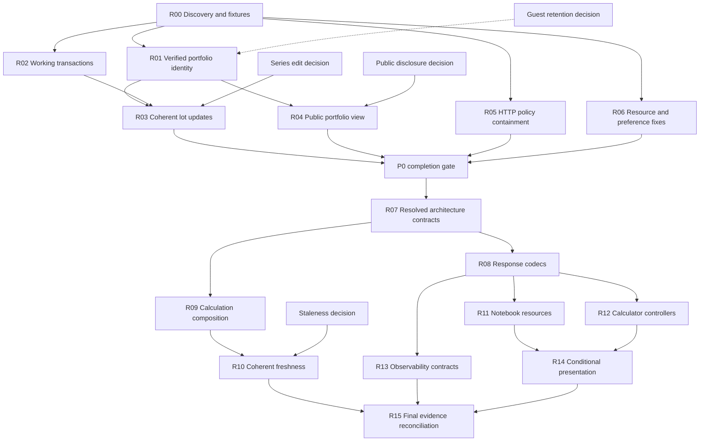

# 35. Full-Stack Architecture Audit

**Audit date:** 2026-09-06

**Status:** Consolidated audit, starter classification, and implementation roadmap for human review. No application changes are implemented by this document.

**Scope:** Current working tree at audit time, including existing uncommitted changes. Historical verification below belongs to the audit, not to the proposed roadmap. Saving and expanding this document does not constitute a new verification run.

## Post-audit commit preparation note

The commit preparation adds `pnpm test:architecture` with a dedicated config
and invokes it from `test:release`. It also aligns the portfolio route contract
with the current application interface and explicitly records existing server
import exceptions. This repairs architecture-suite discovery only; the broader
contract discovery and resolved-import roadmap remains outstanding. The notebook
controller effect now depends on its specific error actions rather than the
entire actions object. Findings below remain the original audit snapshot.

## Contents

- [Executive summary](#1-executive-summary)
- [Architecture map](#2-current-architecture-map-and-dependency-direction)
- [Findings](#3-evidence-backed-findings-in-priority-order)
- [Reuse overview](#4-reusable-candidates-versus-domain-local-code)
- [Enforcement gaps](#5-missing-or-weak-architecture-enforcement-tests)
- [Non-recommendations](#6-deliberate-non-recommendations)
- [Product decisions](#7-product-decisions-and-uncertainties)
- [Detailed starter classification](#8-detailed-dashboard-starter-classification)
- [Starter structure and example](#9-proposed-starter-structure-and-first-feature)
- [UI-only Atomic Design policy](#10-ui-only-atomic-design-policy)
- [Package decision checklist](#11-package-extraction-decision-checklist)
- [Application-local inventory](#12-modules-that-must-remain-in-this-application)
- [Implementation roadmap](#13-safe-implementation-roadmap)
- [Dependencies](#14-roadmap-dependency-graph)
- [Commit sequence](#15-proposed-commit-sequence)
- [Validation matrix](#16-final-validation-matrix)
- [Do not implement](#17-do-not-implement)

## 1. Executive summary

The repository has a useful feature-oriented structure, but several interfaces promise stronger isolation and correctness than their implementations currently provide. **Fix the server correctness issues and restore executable architecture enforcement before treating this as a dashboard template.**

The strongest existing modules are the calculation workflow/cancellation machinery, strict request-body reader, provider sync gateway, normalized financial display models, and recently extracted pure projections. Their interfaces hide meaningful behavior and concentrate knowledge.

The main weaknesses are:

- Guest identity is not authenticated before owner-scoped portfolio reads.
- Production transaction calls use an incompatible database adapter.
- Public portfolio pages reuse an authenticated editing workflow.
- Lot updates can leave stored bond identifiers inconsistent.
- Architecture contracts are excluded from Vitest discovery.
- Several controller extractions move code without sufficiently reducing what callers must know.

The earlier audit's web-vitals serialization and portfolio-access envelope defects are repaired in the audited working tree. They should not remain listed as outstanding P0 findings.

**Verification:** No source files were changed during the audit. Six focused suites passed **17 tests**, covering HTTP handling, browser clients, telemetry serialization, and notebook/multi-asset projections:

```text
lib/server/http/api-handler.test.ts
shared/lib/api-client.test.ts
shared/lib/portfolio-client.test.ts
shared/lib/web-vitals-payload.test.ts
lib/data/multi-asset-history-projection.test.ts
features/notebook/lib/portfolio-detail-projection.test.ts
```

`pnpm exec vitest list tests/contracts/architecture` discovered **no tests**. Production database operations and authenticated browser journeys were not executed; findings below distinguish source evidence from deployment-dependent uncertainty.

The audit began with `README.md`, `package.json`, the architecture contract tests, and architecture documents [00](./00_developer_guide.md), [19](./19_system_architecture.md), [26](./26_engineering_and_coding_rules.md), [33](./33_http_boundary_contract.md), and [34](./34_modularity_refactoring_audit.md).

## 2. Current architecture map and dependency direction

| Layer                                             | Current ownership                                                  | Assessment                                                                                                      |
| ------------------------------------------------- | ------------------------------------------------------------------ | --------------------------------------------------------------------------------------------------------------- |
| `app/`                                            | Routes, metadata, layouts, provider composition                    | Generally thin; public portfolio composition is a significant exception.                                        |
| `features/*`                                      | Product journeys, controllers, forms, projections                  | Useful ownership by capability. Some controller interfaces still expose implementation state.                   |
| `features/bond-core`                              | Financial types, engines, handlers, application orchestration      | Strong domain concentration, but pure domain and server infrastructure share one dependency namespace.          |
| `components/ui`                                   | Radix-based visual primitives                                      | Appropriate visual reuse; this root is missing from the main architecture scanner.                              |
| `shared/components`, `shared/hooks`, `shared/lib` | Cross-feature UI, transport, persistence, formatting, display      | Contains both template infrastructure and bond-specific shared code. “Shared” does not mean domain-independent. |
| `lib/server`                                      | HTTP policy, authorization, commands, queries, repositories        | Good named capabilities; some security invariants remain caller obligations.                                    |
| `lib/data`                                        | Read models, database retrieval, fallback and cache policy         | Public interfaces are useful, but snapshot consistency and fallback provenance need stronger ownership.         |
| `lib/sync`, `lib/api-clients`, Inngest            | Provider adapters and durable synchronization                      | Real adapter variation justifies these seams. Documentation understates these layers.                           |
| `db`, `drizzle`                                   | Runtime database construction, schema, migrations                  | Migration authority is explicit; runtime/test adapter mismatch undermines transaction proof.                    |
| Tests and CI                                      | Behavioral, source-policy, database, browser, accessibility checks | Broad coverage categories exist, but discovery and test-surface gaps weaken the assurance.                      |

The intended direction is sensible:

```text
pages / feature views → journey controllers → browser gateways
API routes → HTTP/auth policy → commands and queries → repositories
calculation orchestration → handlers → financial engines
repositories / provider adapters → external systems
```

Actual direction is less strict:

- `features/bond-core/application-service.ts` imports data retrieval and server logging.
- Several handlers import data or server modules directly.
- `shared/types/portfolio.ts` re-exports database row types.
- Shared HTTP parsing and problem mapping import calculation-domain errors.
- `shared/lib/bond-display.ts` and related modules intentionally depend on bond-domain types.

These are different issues. Shared financial display code depending on the financial domain is reasonable. Pure domain code acquiring persistence dependencies, or generic HTTP infrastructure depending on calculator errors, reduces substitutability and template reuse.

Here, a **module** means code with an interface and implementation. Its **interface** includes required invariants and errors, not merely TypeScript parameters. A **seam** permits behavior to change without editing callers; an **adapter** fulfills that seam. **Depth** is the leverage obtained from that interface, while **locality** describes how concentrated changes and knowledge remain.

## 3. Evidence-backed findings, in priority order

### F1 — P0: An unsigned guest cookie can select an authenticated owner's private reads

**Evidence and coupling:** In [access.ts](../../../lib/server/portfolio/access.ts), `resolvePortfolioOwner()` accepts `guest_portfolio_owner_id` verbatim as `ownerId`. `ensureGuestPortfolioOwner()` inserts that ID with `onConflictDoNothing()`, so an existing authenticated user ID is not rejected. `withPortfolioRead()` then passes it to:

- `app/api/portfolio/route.ts` → `listPortfolios`
- `app/api/portfolio/lots/route.ts` → `listLots`
- `app/api/portfolio/summary/route.ts` → `summarizePortfolios`

Repository owner predicates faithfully enforce the supplied ID, but its provenance is untrusted. A caller who knows another owner ID can select that owner's read scope. `HttpOnly` does not authenticate a cookie supplied by an HTTP client. Mutation authentication remains separately enforced.

**Desired module/interface:** A portfolio-access module should return a verified principal with explicit read capabilities. Guest preview must not resolve arbitrary authenticated ownership. Cookie verification, identity namespaces, and authentication failure handling stay internal. This increases depth by removing identity-provenance obligations from every query caller.

**Migration:** Preserve authenticated behavior; make guest preview return nonprivate preview data. If persisted guest records remain a requirement, introduce verified guest sessions with a separate identity namespace and an explicit legacy migration policy.

**Required proof:** Exercise actual route resolution with forged authenticated-owner IDs, malformed/legacy guest cookies, anonymous requests, and valid sessions. Assert no private data or foreign-owner association. Add authenticated/guest browser transitions.

**Classification:** Reusable authorization pattern; portfolio guest policy is domain-local.

### F2 — P0: Transactional repositories use an adapter that rejects callback transactions

**Evidence and coupling:** [db/index.ts](../../../db/index.ts) constructs `drizzle-orm/neon-http`. `createLotWithBuyTransaction()` and `importPortfolioAtomically()` in `lib/server/portfolio/repository.ts` call `db.transaction(async tx => …)`.

The installed adapter implementation, `node_modules/drizzle-orm/neon-http/session.js:151`, throws `No transactions support in neon-http driver`.

Meanwhile, `db/postgres-migrations.integration.test.ts` uses `postgres-js` and handwritten `sql.begin()` operations. Those tests verify PostgreSQL behavior without exercising the production repository adapter.

**Desired module/interface:** The portfolio persistence module must genuinely guarantee atomic completion or rollback. Driver capabilities and transaction execution stay internal; callers retain the existing business operations.

**Migration:** Use a transaction-capable production adapter, or implement these operations through a supported atomic mechanism. Preserve ownership predicates, decimal representation, returned values, and error mapping. Keep migration execution separate from runtime construction.

**Required proof:** Invoke the actual production repository implementation against an isolated migrated database. Verify successful import and lot-plus-buy creation, then force a later write failure and assert complete rollback. Add an authenticated import/save browser journey.

**Classification:** Transaction-capable database construction is template infrastructure; portfolio transactions are domain-local.

### F3 — P0: Lot updates do not maintain the lot's bond/series invariant

**Evidence and coupling:** `InvestmentLotUpdateSchema` in `features/bond-core/types/portfolio-schemas.ts` accepts `bondType`, `purchaseDate`, and `selectedSeriesId`. However, [commands.ts](../../../lib/server/portfolio/commands.ts) `updateOwnerLot()` spreads the input into `Record<string, unknown>` and sends it to `updateLotByOwner()`.

Unlike creation, it does not resolve `bondTypeId` or `bondSeriesId`. The database column is `bondSeriesId`, not `selectedSeriesId`. Changing the bond or purchase date can therefore retain identifiers from the previous lot context.

**Desired module/interface:** `updateOwnerLot(owner, lotId, patch)` should own coherent lot updates. Existing values, series resolution, field-to-column mapping, and owner checks stay internal. The repository should accept a typed persistence update instead of an unrestricted record.

**Migration:** Load the required current lot context, merge permitted changes, resolve dependent identifiers, and persist a coherent update. Preserve omitted-field semantics and strict validation. Decide explicitly how unavailable series resolution affects a mutation.

**Required proof:** Cover bond changes, purchase-date changes, series-only updates, invalid series relationships, and omitted fields. Verify persisted identifiers through the actual repository; add an edit/reload/export browser check.

**Classification:** Domain-local.

### F4 — P0: Public portfolio rendering crosses the wrong workflow seam

**Evidence and coupling:** The [shared-portfolios page](../../../app/shared-portfolios/[shareId]/page.tsx) renders:

```tsx
<PortfolioDetails portfolio={portfolio} onBack={() => {}} />
```

`PortfolioDetails` is a client module, so the server page passes a nonserializable callback. It also requires bond definitions without this page supplying `BondDefinitionsBoundary`.

More fundamentally, `usePortfolioDetailsWorkspace()` loads lots through owner-scoped endpoints and exposes sharing/export actions. A public viewer is not the portfolio owner. `getPublicSharedPortfolioPageData()` currently returns portfolio metadata rather than a complete public read model.

**Desired module/interface:** A public-portfolio query should expose a deliberately limited, serializable read model by share ID. A public view renders that model without authenticated workspace actions. Visibility checks and any simulation/data loading stay internal to the public query.

**Migration:** Preserve share URLs and `isPublic` checks; compose the public page from public data and presentation modules. Reuse existing pure projections where semantics match. Keep owner workflows separate.

**Required proof:** Production-mode browser tests for anonymous public viewing, revoked/private shares, and unknown IDs. Assert no serialization errors, owner-only requests, or mutation controls. Test the public DTO's field allowlist.

**Classification:** Public-resource query pattern is reusable; portfolio disclosure is domain-local.

### F5 — P0: Request protection has uncontained failures and an incomplete identity trust contract

**Evidence and coupling:**

- `createApiHandler()` in [api-handler.ts](../../../lib/server/http/api-handler.ts) awaits `configuredRateLimiter.consume()` **before** its `try/catch`. A production counter-store failure bypasses correlated problem mapping.
- `getClientIdentity()` trusts `x-real-ip` even when `TRUSTED_PROXY` is disabled. With proxy trust enabled, it selects the first forwarded address.
- Whether those addresses are trustworthy depends on deployment header sanitization, which the application interface does not establish.

The counter-store failure is directly supported by source. Rate-limit bypass depends on which headers the actual ingress permits or rewrites.

**Desired module/interface:** The HTTP-policy module must own the complete protected request lifecycle. Its interface should document limiter failure behavior and accept identity only from a verified ingress policy. Storage failures and header interpretation stay internal.

**Migration:** Include policy acquisition in correlated failure handling; retain fail-closed protection. Define the deployment's trusted address source and normalize valid addresses. Do not silently switch production to memory limits.

**Required proof:** A throwing limiter must produce a safe correlated failure without invoking the handler. Test forged `x-real-ip`, forwarded chains, malformed addresses, and trusted-hop behavior. Retain ingress-level evidence for the deployed configuration.

**Classification:** Template infrastructure with a deployment-specific identity adapter.

### F6 — P1: Architecture enforcement is both undiscovered and inconsistent with current ownership

**Evidence and coupling:** [vitest.config.ts](../../../vitest.config.ts) excludes `*contract.test.*` and `*-boundary.test.*`, including the architecture tests explicitly listed by `test:release`. Discovery returned no architecture tests.

If enabled, existing contracts conflict with current code:

- `layer-boundary-contract.test.ts` forbids server imports already present in the calculation application service and handlers.
- Portfolio route contracts require direct command/query imports, while routes use `portfolioApplication`.
- The scanner misses `components`, `i18n`, `db`, root composition files, relative imports, re-exports, and transitive dependency violations.
- CI does not invoke the documented `scan:unused` gate.

**Desired module/interface:** A named architecture-test suite should enforce resolved dependency rules, with explicit server-composition exceptions. Its interface is the documented allowed dependency graph—not a list of required import strings.

**Migration:** Restore discovery first. Reconcile actual ownership with the rules, then replace spelling-based checks with resolved import enforcement. Remove facade-delegation tests that merely restate implementation. Update the previous audit's status and CI documentation in the same migration.

**Required proof:** CI must report a nonzero architecture-test count. Small violation fixtures should prove detection of aliases, relative imports, re-exports, dynamic imports, and prohibited transitive browser dependencies.

**Classification:** Template infrastructure.

### F7 — P1: Explicit response codecs still do not validate their contract

**Evidence and coupling:** [api-response-codec.ts](../../../shared/lib/api-response-codec.ts) `decodeEnvelopeResponse()` casts JSON to `ApiResponse<T>` and returns `payload.data as T`. A successful raw object still resolves to `undefined`.

Server failures also have multiple shapes:

- `errorJson()` returns an envelope.
- `apiHandler()` returns problem details.
- `createUnauthorizedResponse()` returns `{ error: 'Unauthorized' }`.

The codec reads only `payload.error?.message/code/details`, losing problem codes, details, and correlation. Calculation-client and worker callers then perform additional error translation.

**Desired module/interface:** The response-decoding module should distinguish valid envelope success, supported public failures, and malformed protocol responses. Callers receive data or one normalized error interface. Shape detection and safe correlation extraction stay internal.

**Migration:** Preserve current wire formats initially; decode them explicitly. Reject malformed successful envelopes. Consolidate worker/browser error normalization. Add payload schemas selectively where runtime validation provides real value.

**Required proof:** Route-to-client tests must cover real response helpers, raw/envelope mismatch, null/malformed JSON, problem details, authorization failure, and worker/browser parity. The current mocked client tests do not establish this end-to-end contract.

**Classification:** Template infrastructure.

### F8 — P1: Calculation orchestration has an incomplete dependency seam

**Evidence and coupling:** [application-service.ts](../../../features/bond-core/application-service.ts) accepts injected dependencies but also constructs production defaults from data retrieval and server logging.

`BaseHandler.withHistoricalData()` and `createEnvelope()` acquire data directly. Other handlers import server offer-resolution behavior. Replacing application-service dependencies therefore does not isolate real handler execution from infrastructure.

Generic `read-json-body.ts` also throws `CalculationDomainError`, coupling ordinary settings/portfolio transport failures to calculator vocabulary.

**Desired module/interface:** Keep financial engines independent of infrastructure. A server calculation-composition module selects production adapters; handler context/dependencies supply authoritative inputs. Generic body-reading errors belong to HTTP infrastructure, with domain error translation supplied at the appropriate composition seam.

**Migration:** Move adapter construction first, retaining `calculate(request)` behavior. Introduce only dependencies already needed by real handlers. Then prohibit persistence/server imports from pure financial modules. Gradually replace database row aliases in browser contracts with owned DTOs when those interfaces change.

**Required proof:** Run real handlers using narrow data fakes without module-wide database mocks. Preserve golden calculations, validation, cache revisions, fallback warnings, and cancellation behavior. Add dependency enforcement for pure engine imports.

**Classification:** Reusable composition pattern; financial context and handlers remain domain-local.

### F9 — P1: Controller extractions remain shallow and asynchronous resource ownership is fragmented

**Evidence and coupling:**

- `SingleCalculatorSessionActions` in [useBondCalculatorEffects.ts](../../../features/single-calculator/hooks/useBondCalculatorEffects.ts) still exposes seven React setters plus multiple lifecycle refs.
- Its series-fetch effect cancels only the timer; an already-started request can resolve after a bond change and commit stale series state.
- `ComparisonContainer` still coordinates URL updates, session state, presentation state, projection, keyboard submission, and callback bundles.
- `useNotebookWorkspaceController()` returns spreads of four internal interfaces.
- `useWorkspacePortfolios()` and `usePortfolioAccess()` maintain independent GET lifecycles despite the documented SWR default. The access hook has no rejection handler.

The current interfaces expose state representation and update ordering. Renaming the bundles has not supplied much additional depth.

**Desired module/interface:** Feature-local controllers expose prepared state and domain actions. Request identity, restoration ordering, setters, refs, and resource errors stay internal. Shared GET resources own deduplication and subscriber updates through the existing SWR seam.

**Migration:** First prevent stale series commits and handle access failures. Then migrate workspace resources while preserving selection behavior. Narrow single-calculator and comparison interfaces incrementally; keep the existing calculation cancellation module.

**Required proof:** Out-of-order request completion, unmount, rapid bond changes, failed access, multiple workspace subscribers, URL restoration, and persisted-state precedence. Browser tests must confirm editing leaves committed results intact until recalculation.

**Classification:** Controller/resource ownership is a reusable pattern; each workflow is domain-local.

### F10 — P1: Financial cache freshness is not one coherent snapshot contract

**Evidence and coupling:** [market-data-cache.ts](../../../lib/data/market-data-cache.ts) stores independently expiring entries in a process-local map. Definitions, freshness, tax revision, and histories use separate keys.

`CalculationContextProvider.load()` combines separate reads and constructs `cacheRevision` from freshness and tax revision. Inngest invalidates only the process executing its invalidation step. Other instances retain their entries until expiry.

Additionally, `getHistoricalAverages()` discards the `source` and `usedFallback` information from `getMultiAssetHistory()`. Callers cannot determine whether those averages came from database history or bootstrap history through the averages interface.

**Desired module/interface:** A calculation-data module should own a coherent revision/freshness contract and preserve provenance for derived values. Cache storage, snapshot acquisition, fallback selection, and acceptable staleness stay internal.

**Migration:** Define the allowed staleness window first. Make every sync path advance a durable revision where required; key related cached values consistently. Preserve existing calculations and surface truthful provenance. Keep multi-asset projection separate; do not introduce a generic cache framework.

**Required proof:** Two independent cache instances across a sync, staggered expiry, unavailable providers, fallback-to-database recovery, and concurrent reads during updates. Verify displayed freshness corresponds to the inputs actually used.

**Classification:** Revision-aware caching is a reusable pattern; fallback acceptance and financial provenance are domain-local.

### F11 — P1: Template preferences do not yet have one reliable runtime interface

**Evidence and coupling:** [ThemeContext.tsx](../../../shared/context/ThemeContext.tsx) installs a media-query listener that closes over `initialTheme`. Switching from system to explicit light/dark leaves a listener that can still apply system changes; switching into system mode from an explicit initial preference does not activate that behavior.

The bootstrap script and provider separately implement resolution. Bootstrap catches unavailable storage, while provider reads/writes do not. Separately, `app/layout.tsx` fixes `<html lang>` to `defaultLocale`; the inspected locale provider refreshes content without updating that attribute.

**Desired module/interface:** Theme preference owns selected preference, resolved theme, persistence failure behavior, and system subscriptions. Locale composition owns the document language. Callers should not coordinate DOM attributes or media listeners.

**Migration:** Preserve storage keys and the nonce-bearing bootstrap. Share the resolution invariant, make subscriptions follow current preference, and tolerate storage failure. Align document language with the selected locale.

**Required proof:** System→explicit→system transitions with media changes, unavailable storage, dark first paint, hydration, locale switching, and correct document language. Use provider/browser behavior tests rather than script-text assertions.

**Classification:** Template infrastructure.

## 4. Reusable candidates versus domain-local code

| Candidate                                              | Classification                  | Reuse assessment                                                             |
| ------------------------------------------------------ | ------------------------------- | ---------------------------------------------------------------------------- |
| Bounded JSON reader, correlation, safe problem mapping | Template infrastructure         | Strong depth; remove calculator-specific errors and contain policy failures. |
| Rate-limiter interface with memory/PostgreSQL adapters | Template infrastructure         | Real variation already exists; retain explicit deployment identity policy.   |
| Envelope/raw transport codecs                          | Template infrastructure         | Reuse after malformed-response and failure-shape contracts are enforced.     |
| Theme, locale composition, focus management            | Template infrastructure         | Useful baseline after runtime preference defects are repaired.               |
| `components/ui` primitives                             | Template infrastructure         | Appropriate visual taxonomy; preserve accessibility behavior.                |
| Calculation cancellation and stale-result control      | Reusable pattern                | Proven asynchronous workflow machinery; avoid a universal page controller.   |
| Feature controller plus pure projection                | Reusable pattern                | Copy the ownership approach, not one controller implementation.              |
| Durable sync and provider gateway                      | Reusable pattern                | Timeouts, batching, orchestration, and adapter tests generalize.             |
| Revision-aware cache/fallback disclosure               | Reusable pattern                | Mechanism generalizes; acceptable staleness does not.                        |
| Bond engines, tax/rollover rules, offer resolution     | Domain-local                    | Financial truth should retain concentrated ownership.                        |
| Market assumptions, bond displays, financial exports   | Domain-local                    | Cross-feature reuse is valid without making these template infrastructure.   |
| Portfolio ownership, lot semantics, share disclosure   | Domain-local                    | Reuse security patterns, not product policy or database rows.                |
| Generic CRUD/router/controller framework               | Reject as premature abstraction | No evidence that it would hide a stable shared decision.                     |
| Separate shared packages                               | Reject as premature abstraction | Validate a second application before choosing package interfaces.            |

## 5. Missing or weak architecture enforcement tests

The existing coverage categories are broad. Browser suites include keyboard access, zoom/reflow, reduced motion, locale cases, axe checks, and diagnostic collection. CI includes build budgets, coverage, migrations, dependency/container checks, and multiple browser engines.

The most important gaps are:

| Gap                                                                | Required stronger proof                                                                      |
| ------------------------------------------------------------------ | -------------------------------------------------------------------------------------------- |
| Architecture contracts excluded from discovery                     | Explicit suite selection and a discovery-count assertion.                                    |
| Regex import checks                                                | Resolved dependency checks across all production roots and import forms.                     |
| Database tests use another adapter and handwritten SQL             | Actual repository operations through the production adapter.                                 |
| Ownership tests start with trusted owner IDs                       | HTTP cookie/session resolution through to repository results.                                |
| Facade tests only verify delegation                                | Command/query invariants and failure behavior.                                               |
| Client tests mock gateways                                         | Real route response → shared codec contracts.                                                |
| Shared-portfolio happy path absent from reviewed smoke coverage    | Anonymous public-share rendering and revocation in production mode.                          |
| Async controller tests miss resource races                         | Deferred responses, cancellation, unmount, and identity changes.                             |
| Browser smoke uses `PLAYWRIGHT_SMOKE=1`                            | A separate authenticated database-backed journey without bypasses.                           |
| `audited-workflows.spec.ts` omitted from named CI browser commands | Explicit inclusion; replace its conditional guest assertion with a required state assertion. |
| Database constraint test can fail for unrelated reasons            | Valid parent fixtures and assertions identifying the intended constraint.                    |
| Local cache invalidation tested in isolation                       | Independent-instance and coherent-revision behavior.                                         |

In particular, a rollback test that executes its own SQL transaction cannot prove that `importPortfolioAtomically()` rolls back—or even starts successfully.

## 6. Deliberate non-recommendations

- No generic CRUD framework, universal page controller, or React class hierarchy.
- No Atomic Design taxonomy for controllers, domain, HTTP, data, or policy modules.
- No extraction based solely on repeated syntax or component length.
- No package split before a second application demonstrates stable shared invariants.
- No universal fallback policy across financial read models.
- No validation relaxation to accommodate incompatible callers.
- No weakening repository ownership checks because routes authenticate.
- No replacement of the existing cancellation workflow, next-intl, or SWR with custom infrastructure.
- No additional visual fragmentation of market-assumption forms or dashboard sections without an independent behavioral reason.
- No claim that the previous audit's completed fixes remain outstanding.

## 7. Product decisions and uncertainties

1. **Guest workspace:** Is anonymous access only a preview, or must existing guest portfolios remain recoverable? This determines the safe guest-identity migration.
2. **Public sharing:** Which fields, lots, notes, calculations, and export capabilities should a public portfolio disclose?
3. **Freshness:** What staleness is acceptable after synchronization across multiple instances? Should unavailable authoritative data block some calculations?
4. **Lot identity:** On bond/date edits, should the application automatically select a compatible series or require explicit confirmation?
5. **Template scope:** Is the next dashboard financial, or unrelated? This determines whether financial display modules belong in the starter.
6. **Operational evidence:** The actual ingress header contract and production database connectivity need verification. Neither was exercised during this read-only audit.

## 8. Detailed dashboard-starter classification

The starter should be a small, independently owned repository with one complete, removable example feature. Copy proven infrastructure selectively; reimplement product policy and feature behavior. Template infrastructure describes the named subset, not its entire source folder. Existing implementations needing substantial repairs are reusable patterns until their prerequisites are met.

| Candidate                                | Classification          | Interface/invariant                                                                                 | Template location                       | Current evidence                                          | Extraction prerequisites                                                           | Do not copy                                                                           |
| ---------------------------------------- | ----------------------- | --------------------------------------------------------------------------------------------------- | --------------------------------------- | --------------------------------------------------------- | ---------------------------------------------------------------------------------- | ------------------------------------------------------------------------------------- |
| Route/layout/loading/error composition   | Reusable pattern        | Routes compose; server/client props are serializable; request-scoped work has an owner.             | `app/`                                  | Root layout, calculator pages, shared-scenario page       | Verify production rendering, hydration, navigation, recovery.                      | Public portfolio callback; calculator providers globally.                             |
| Metadata conventions                     | Reusable pattern        | Explicit canonical URL, deployment indexability, localized titles, safe structured data.            | `lib/metadata/`, route exports          | `lib/page-metadata.ts`, `lib/site-url.ts`, `lib/seo/`     | Replace route catalog and structured-data model; test private/public tiers.        | Financial descriptions, production URLs, branding.                                    |
| next-intl request configuration          | Template infrastructure | Supported locales, deterministic fallback, configured timezone, explicit runtime entrypoints.       | `i18n/`                                 | `i18n/config.ts`, `request.ts`, `client.ts`               | Configure locales/timezone; verify document language.                              | Polish/Warsaw assumptions as universal defaults; product messages.                    |
| Locale formatting                        | Reusable pattern        | Explicit locale, currency, calendar-date/instant semantics; formatting preserves underlying values. | `shared/lib/formatting/`                | `shared/lib/formatters.ts`, formatter hooks               | Remove duplicated language types and implicit PLN; test timezone differences.      | Financial precision defaults and host-dependent dates.                                |
| Locale parity checks                     | Template infrastructure | Matching keys, value types, variables, nonempty messages.                                           | `i18n/tests/`                           | `i18n/locale-parity.test.ts`                              | Retain generic checks; support ICU plural/select syntax when used.                 | Bond namespaces and Polish-specific spelling policy.                                  |
| Theme lifecycle                          | Reusable pattern        | Selected/resolved theme stays consistent across system changes, storage failure, hydration.         | `shared/theme/`                         | `ThemeContext.tsx`, `theme-preferences.ts`                | Repair listener closure/storage failures; verify first paint.                      | Current provider unchanged and branded storage keys.                                  |
| Semantic design tokens                   | Template infrastructure | Semantic color, spacing, typography, focus, motion roles.                                           | Styles and root CSS                     | `app/globals.css`, primitive variants                     | Select coherent subset; verify contrast/reflow.                                    | Bond colors, financial chart selectors, calculator geometry.                          |
| Radix visual primitives                  | Template infrastructure | Native semantics, keyboard/focus behavior, disabled/invalid states.                                 | `shared/ui/`                            | `components/ui/`                                          | Copy only primitives used by shell/example with behavior tests.                    | Entire unused catalog, financial widgets, duplicate UI roots.                         |
| Dashboard/page sections                  | Reusable pattern        | Prepared content, heading hierarchy, responsive composition.                                        | Shared composition and feature views    | Page shells, section blocks, result surfaces              | Separate generic layout from calculator vocabulary.                                | Universal configurable page or financial verdict panels.                              |
| Browser transport/codecs                 | Reusable pattern        | Explicit success codec, normalized public failures, cancellation distinct from success.             | `shared/http/`                          | API client, response codec, calculation client/worker     | Reject malformed envelopes; preserve problems/correlation; contract tests.         | Unchecked success casts, calculator endpoints, repeated error translation.            |
| Request correlation                      | Template infrastructure | Validated/generated IDs consistently associate responses and safe logs.                             | `lib/server/http/`                      | `request-context.ts`                                      | Verify header/body agreement, cookies, selected wire contract.                     | Unneeded legacy response accommodations.                                              |
| Bounded decoding/problems                | Reusable pattern        | Bound bytes before allocation; strict media/encoding/schema validation; safe errors.                | `lib/server/http/`                      | Body reader, problem mapping                              | Replace calculator transport errors; preserve limits and strictness.               | Calculation-domain dependency and branded error URLs.                                 |
| Handler/rate-limit composition           | Reusable pattern        | Policy and execution share failure containment; trusted identity source is explicit.                | Server HTTP and runtime composition     | Handler, limiter, PostgreSQL store                        | Contain store failures; verify ingress; test actual distributed adapter.           | Financial quotas, unverified header trust, production smoke bypasses.                 |
| Auth/ownership                           | Reusable pattern        | Verified principal; capability authorization; owner predicates in persistence.                      | Server auth and capability modules      | `auth.ts`, portfolio access/repository, admin auth        | Decide new product identity model; cross-owner tests.                              | Unsigned guest identity; portfolio ownership; universal admin allowlist.              |
| Controller/pure projection               | Reusable pattern        | Controller owns lifecycle/actions; projection is deterministic and I/O-free.                        | `features/<feature>/hooks`, `lib`       | Notebook projections, comparison models, calculator hooks | Hide setters/refs; verify restoration, failures, races.                            | Universal controller and spread-based exposure of internals.                          |
| GET resource ownership                   | Reusable pattern        | Stable keys, deduplication, refresh/error state, identity-aware cache lifecycle.                    | Feature hooks using SWR                 | SWR convention; workspace/access exceptions               | Preserve selection and define sign-in/out invalidation.                            | Independent per-consumer caches for one resource.                                     |
| Repositories/transactions                | Reusable pattern        | Operation-shaped interface guarantees scope and atomicity.                                          | Server interface; internal data adapter | Portfolio and provider repositories                       | Transaction-capable adapter; real repository contract tests.                       | Unsupported callback transactions and handwritten SQL as application proof.           |
| Cache/fallback                           | Reusable pattern        | Explicit freshness, revision, provenance, failure semantics.                                        | Owning read model                       | Market cache, history projection, calculation context     | Establish staleness policy; test independent instances.                            | Universal fallback, financial bootstrap data, implied global invalidation.            |
| Safe server logging                      | Template infrastructure | Bounded details, sensitive-key redaction, safe error classification.                                | Server logging                          | `lib/server/logging.ts`, tests                            | Keep fixed message conventions; arbitrary strings are not automatically sanitized. | Secrets/PII in message strings or assumption that key redaction protects all text.    |
| Browser logging                          | Reusable pattern        | Explicitly limited diagnostic payloads.                                                             | Shared observability                    | Client logger currently forwards to console               | Define safe browser fields/error reporting policy.                                 | Raw forwarding presented as a privacy guarantee; policy-free wrappers.                |
| Web Vitals                               | Reusable pattern        | Payload allowlist, privacy controls, bounded cardinality, retention, safe ingestion failures.       | Shared/server observability             | Reporter, payload serializer, aggregate repository        | Normalize route labels; choose retention/sampling; sender-to-route proof.          | Dynamic IDs in paths, financial inputs, automatic 30-day retention policy.            |
| Test pyramid/contracts                   | Reusable pattern        | Public behavior is test surface; resolved dependency policies actually execute.                     | `tests/`, feature tests, configs        | Vitest, Playwright, DB/architecture suites                | Restore discovery; actual adapter and authenticated browser tests.                 | Excluded contracts, spelling tests, inherited coverage thresholds without assessment. |
| Documentation/AI instructions            | Reusable pattern        | One ownership guide; discoverable docs; explicit verification/operational authority.                | README, AGENTS, docs                    | Architecture guide, documentation rules, project skills   | Write instructions for actual starter commands and structure.                      | Financial rules, stale claims, GCP identity, bond-sync skills.                        |
| Scripts/CI                               | Reusable pattern        | Reproducible checks, migration discipline, verified deploy artifacts.                               | Scripts/workflows                       | CI, config checks, bundle/smoke scripts                   | Parameterize project facts; verify gates are discovered and run.                   | Migration hashes, service names, route budgets, existing fixtures/secrets.            |
| Generic CRUD/controller/facade framework | Reject                  | No stable behavior demonstrated beyond delegation.                                                  | None                                    | Facade duplication and setter-heavy interfaces            | Require demonstrated hidden behavior before abstraction.                           | Base classes, universal routers, configuration layers for uniformity.                 |
| Shared package/monorepo                  | Reject for this phase   | Two independent applications must need the same invariant/interface.                                | None                                    | Only one application evaluated                            | Complete section 11 after a second project exists.                                 | Boundaries inferred from folder or syntax similarity.                                 |

No module currently qualifies as a future package candidate on the available evidence. Documentation of template readiness is not package extraction.

## 9. Proposed starter structure and first feature

This is a future copied repository, not a directory migration proposed for this application.

```text
dashboard-starter/
├── app/
│   ├── layout.tsx
│   ├── globals.css
│   ├── error.tsx
│   ├── not-found.tsx
│   ├── (dashboard)/
│   │   ├── layout.tsx
│   │   └── saved-views/page.tsx
│   └── api/
│       ├── saved-views/route.ts
│       ├── health/route.ts
│       └── readiness/route.ts
├── features/saved-views/             # Removable example
│   ├── contracts.ts                 # Browser-safe DTOs/schemas
│   ├── gateway.ts
│   ├── components/
│   ├── hooks/
│   ├── lib/                         # Pure projections/state decisions
│   └── tests/
├── shared/
│   ├── ui/
│   ├── components/                  # Shell, focus, feedback
│   ├── http/
│   ├── theme/
│   ├── observability/
│   └── lib/formatting/
├── i18n/                           # Config, runtime entrypoints, messages/tests
├── lib/
│   ├── metadata/
│   ├── server/
│   │   ├── auth/
│   │   ├── http/
│   │   ├── logging/
│   │   ├── runtime/
│   │   └── saved-views/
│   │       ├── queries.ts
│   │       ├── repository.ts        # Interface owned by consumer
│   │       └── composition.ts       # Chooses adapter
│   └── data/saved-views/postgres-repository.ts
├── db/                             # Client and schema
├── drizzle/                        # Ordered migrations
├── tests/                          # Architecture, contracts, integration, browser
├── scripts/
├── docs/                           # Architecture and operations
├── .github/workflows/
├── AGENTS.md
└── README.md
```

Add commands, jobs, caching, and providers only when needed. Feature gateways stay local until independent consumers demonstrate shared ownership. Cross-runtime contracts contain serializable values and schemas, not database row aliases. Server implementations use server-only guards; dependency rules prevent browser imports from reaching implementations through barrels.

### Minimal first feature: My saved views

The interface is “list the current user's saved views as serializable DTOs.” SQL, ownership filtering, and row conversion stay internal.

```text
page → SavedViewsScreen → useSavedViewsController → gateway
     → HTTP GET route → listSavedViews query → PostgreSQL adapter
     → query/adapter behavioral test plus route-to-codec contract
```

The snippets are illustrative proposed code, not existing callable interfaces. Imports and fixture setup are abbreviated.

```ts
// features/saved-views/contracts.ts
export const SavedViewSchema = z
  .object({
    id: z.string().uuid(),
    name: z.string(),
  })
  .strict();
export const SavedViewListSchema = z.array(SavedViewSchema);
export type SavedView = z.infer<typeof SavedViewSchema>;

// features/saved-views/gateway.ts
export const savedViewsGateway = {
  list: () => getEnvelope('/api/saved-views', SavedViewListSchema),
};

// features/saved-views/hooks/useSavedViewsController.ts
export function useSavedViewsController() {
  const [filter, setFilter] = useState('');
  const resource = useSWR('/api/saved-views', savedViewsGateway.list);
  return {
    rows: projectSavedViews(resource.data ?? [], filter),
    filter,
    changeFilter: setFilter,
    isLoading: resource.isLoading,
    error: resource.error,
    retry: () => resource.mutate(),
  };
}
```

The projection is pure. Authentication transitions invalidate private resource caches. Loading/error views and labels use locale resources.

```ts
// lib/server/saved-views/repository.ts
export interface SavedViewsRepository {
  // Only this owner's rows; failures reject.
  listByOwner(ownerId: string): Promise<SavedView[]>;
}

// lib/server/saved-views/queries.ts
export function listSavedViews(
  principal: AuthenticatedPrincipal,
  repository: SavedViewsRepository,
) {
  return repository.listByOwner(principal.userId);
}

// lib/server/saved-views/composition.ts
export const savedViewsQueries = {
  list: (principal: AuthenticatedPrincipal) =>
    listSavedViews(principal, postgresSavedViewsRepository),
};

// app/api/saved-views/route.ts
export const GET = apiHandler(async () => {
  const principal = await requireAuthenticatedPrincipal();
  return okJson(await savedViewsQueries.list(principal), {
    headers: { 'Cache-Control': 'private, no-store' },
  });
});

// lib/data/saved-views/postgres-repository.ts
export const postgresSavedViewsRepository: SavedViewsRepository = {
  listByOwner(ownerId) {
    return db
      .select({ id: savedViews.id, name: savedViews.name })
      .from(savedViews)
      .where(eq(savedViews.ownerId, ownerId));
  },
};
```

The principal comes from a verified session, never a query parameter. The behavioral test exercises the actual query/adapter, not a mock assertion about delegation:

```ts
it('returns only the authenticated owner’s saved views', async () => {
  const fixture = await createSavedViewsFixture(); // Isolated migrated DB
  await fixture.seed([
    { owner: 'alice', name: 'Weekly overview' },
    { owner: 'bob', name: 'Private report' },
  ]);
  const result = await listSavedViews(
    fixture.principal('alice'),
    fixture.repository, // Production adapter pointed at fixture DB
  );
  expect(result.map((view) => view.name)).toEqual(['Weekly overview']);
});
```

Complete the example with route-to-codec success/auth/failure tests, controller loading/retry/filter tests, and one authenticated keyboard-operable browser journey. Add a command only when creating a view becomes a requirement; then add strict body validation, mutation-origin policy, and persistence proof.

## 10. UI-only Atomic Design policy

| Level            | Responsibility               | Examples                                    | Excluded responsibility                      |
| ---------------- | ---------------------------- | ------------------------------------------- | -------------------------------------------- |
| Tokens           | Semantic visual values       | Surface/text/focus, spacing, motion         | Business thresholds, currencies, rate policy |
| Atoms            | Small accessible controls    | Button, input, label, badge                 | Fetching, authorization, persistence         |
| Molecules        | Focused visual interaction   | Field with error, search input              | Domain validation and server commands        |
| Organisms        | Composed visual behavior     | Navigation, toolbar, confirmation dialog    | Universal controller or repository access    |
| Page composition | Arrange feature views/states | Header, content, loading/error presentation | Financial calculations or ownership          |

- Use this vocabulary in design documentation; folders need not be called atoms or molecules.
- Feature-specific visual organisms remain in their feature.
- Forms render validation feedback from their owning workflow. Domain schemas do not move into UI primitives.
- Primitive tests verify interaction/accessibility, not implementation spelling.
- Controllers, contracts, commands, queries, adapters, and policies retain their own architecture vocabulary.

## 11. Package-extraction decision checklist

A module becomes a future package candidate only after evidence supports all relevant answers:

- Two independently built applications already require it; copying the starter example is insufficient.
- Both need the same invariant, errors, ordering constraints, security guarantees, and interface.
- Neither requires application flags, domain exceptions, or callback escape hatches.
- Removing the module would redistribute meaningful behavior across callers: it has depth.
- There is a maintainer, versioning policy, and migration responsibility.
- Contract tests run without either application's schema, fixtures, environment, or branding.
- Dependencies do not force unnecessary runtime/framework coupling.
- Proposed adapter seams have actual variation.
- Independent releases justify compatibility and security maintenance.
- Both projects can adopt one small extracted module without a monorepo or broad migration.

If invariants differ, retain separate implementations. No package extraction is authorized by this roadmap.

## 12. Modules that must remain in this application

- `features/bond-core`: engines, scenarios, model versions, financial schemas, tax, rollover, payout, accounting, offer semantics.
- Single/comparison/regular/ladder/optimization/retirement/multi-asset/recovery calculator journeys.
- Notebook/portfolio models: lots, purchases, buy transactions, maturity, sharing, imports/exports, ownership policy.
- Economic/education content: Polish bonds, CPI/NBP interpretation, reference dashboards, localized financial copy.
- Financial display/export modules under `shared/lib`: normalized timelines, rollover inference, tax labels, CSV/PDF projections, scenario facts.
- Offer merging, issued-series resolution, historical averages, bootstrap data, aliases, financial fallback acceptance.
- Provider-specific sync, official-source verification, bond-series seeds, financial schedules.
- Financial DB schema, migration history, production seeds, migration hashes.
- Financial golden tests and product-specific browser/a11y journeys.
- Navigation catalog, metadata, branding, deployment identifiers, route budgets, operational evidence.
- Bond-offer-freshness skill and current private-preview procedures.

## 13. Safe implementation roadmap

### Delivery rules applying to every item

This is a plan for review, not permission to deploy or migrate production. Recheck each finding against the implementation before changing it: the audit includes uncommitted work and can become stale.

- Preserve URLs, public schemas, success/error shapes, financial results, saved data, locale keys, theme keys, focus behavior, and output except for a named defect fix.
- Characterize the public behavior before changing implementation. Keep characterization tests when they protect real invariants.
- Keep adapter selection inside the owning module's production composition. Tests may inject dependencies through an internal construction seam.
- Each numbered migration step is a proposed commit-sized change. A regression test and its repair can land together; do not require broken intermediate commits on the main branch.
- Each completed seam updates `00_developer_guide.md`, `19_system_architecture.md`, and/or `33_http_boundary_contract.md` as applicable, plus its relevant product/testing document. Update status in this report and the older audit without erasing historical evidence. Change `docs/index.md` when adding a document.
- Architecture tests change alongside the seam they govern. Replace obsolete source-spelling assertions only when behavioral tests or resolved dependency enforcement cover the actual rule.
- Run the item's focused commands and the common per-commit gate below. New test filenames/configs/scripts named below are proposed deliverables, not files claimed to exist today.
- Database commands run only against an explicitly isolated test database. Never point a test fixture, reset, or seed at production. Browser integration setup must seed real test sessions through test infrastructure, not add an application authentication bypass.
- Security rollback never restores an exploitable path. Disable the affected capability with the existing safe error behavior or ship a corrective patch. Data migrations use expand/contract; do not delete user data on rollback.

Common per-commit gate after each item's focused tests:

```bash
pnpm check:types
pnpm lint
pnpm format:check
```

### R00 — P0 verification prerequisite: Establish an honest execution baseline

**Goal/files:** Prevent false confidence while fixing P0s. Affect `vitest.config.ts`, new `vitest.contracts.config.ts`, `package.json`, `.github/workflows/ci.yml`, `package-scripts-contract.test.ts`, and new `scripts/check-test-discovery.ts`. Do not resolve all architectural debt before security repairs.

**Before → after interface:** Listed tests may be excluded silently → a named contract suite with explicit discovery, no empty-suite success, and a baseline distinguishing existing policy conflicts from new regressions.

**Migration commits:**

1. Record working-tree baseline, current failures, and discovered test files. Add isolated DB/browser fixture configuration for upcoming P0 regression tests. New behavioral tests use discoverable `.test.ts` names.
2. Add a contract config that excludes generated output/browser specs but includes architecture/deployment contracts. Add `test:contracts` and `check:test-discovery`. Report all existing contradictions explicitly; do not hide them with broad exclusions. R07 reconciles them before final release approval.

**Compatibility/rollback:** No runtime changes. Revert runner wiring independently if needed, keeping explicit discovery evidence. P0 patches can use direct focused behavioral commands while old architecture contradictions remain visible.

**Proof/commands:** Discovery check must fail for missing expected suites or zero tests. Package-script tests verify actual inclusion intent, not just script text.

```bash
pnpm exec vitest list
pnpm exec vitest list --config vitest.contracts.config.ts
pnpm check:test-discovery
pnpm test:contracts
```

**Done:** Every advertised gate has a known discovered suite; baseline conflicts are enumerated; no release claim depends on excluded tests. **Classification:** Current-app fix.

### R01 — P0: Verify portfolio read identity

**Goal/files:** Fix F1 in `lib/server/portfolio/access.ts` (`resolvePortfolioOwner`), `http.ts` (`withPortfolioRead`), `repository.ts` (`ensureGuestPortfolioOwner`), and portfolio GET routes.

**Before → after interface:** Arbitrary cookie string becomes owner ID → access module returns verified authenticated ownership or a nonprivate guest-preview capability. Query callers never interpret identity cookies.

**Migration commits:**

1. Add forged-cookie/session route regressions and close authenticated-owner reads through guest IDs. Preserve signed-in results and existing guest-preview response shapes where possible.
2. Based on the guest retention decision, either retire guest persistence access or introduce a verified guest session in a distinct namespace. Preserve legacy records; provide a reviewed recovery procedure if needed. Never silently bind unverified cookies to old owners.

**Compatibility/rollback:** Explicit security fix changes unauthorized reads. Guest recovery policy requires a human decision, but that must not delay closing private reads. Keep data intact; rollback leaves guest reads safely disabled, not vulnerable.

**Proof/commands:** Add `lib/server/portfolio/access.test.ts` and `app/api/portfolio/access-security.test.ts`: forged known owner ID, guest, auth unavailable, legitimate owner, foreign lots/summary, no unintended owner insertion.

```bash
pnpm exec vitest run lib/server/portfolio/access.test.ts app/api/portfolio/access-security.test.ts lib/server/portfolio/access-payload.test.ts
pnpm exec playwright test --config playwright.integration.config.ts tests/browser/portfolio-auth.spec.ts
```

The new integration config must run against an isolated configured deployment with real sessions and smoke bypasses disabled. **Done:** Every private read has verified identity provenance; guest behavior is documented and exercised. **Classification:** Current-app fix.

### R02 — P0: Make portfolio transaction guarantees executable

**Goal/files:** Fix F2 in `lib/server/portfolio/repository.ts`, specifically `createLotWithBuyTransaction` and `importPortfolioAtomically`; add an internal transaction-capable adapter and explicit connection construction under `db/`. Update `db/postgres-migrations.integration.test.ts` and new repository integration tests.

**Before → after interface:** Callback transactions on an unsupported runtime driver → unchanged portfolio operations backed by a supported atomic adapter.

**Migration commits:**

1. Reproduce failure through the installed runtime adapter without changing production configuration. Add a narrowly owned transaction adapter using a supported PostgreSQL driver, bounded connections, and explicit lifecycle. Keep selection inside the portfolio persistence module. Avoid an application-wide driver swap in this slice.
2. Route the two atomic operations through that adapter. Exercise successful writes and forced later-write rollback using the exact adapter implementation. Remove duplicate transactional bodies.
3. Validate actual deployment connectivity and connection budgets in a nonproduction environment. Extend `test:db` to include repository integration tests, retaining schema/migration tests.

**Compatibility/rollback:** Preserve schema, amounts, IDs, timestamps, return values, and import limits. Separate transaction connection configuration must be explicit and validated. If unavailable, keep affected writes safely unavailable; do not revert to nontransactional writes. No destructive migration is required for an adapter fix.

**Proof/commands:** Add `db/portfolio-repository.integration.test.ts`; test metadata-plus-lots rollback and lot-plus-buy rollback, successful data, exact decimal values, ownership prerequisites. The existing handwritten SQL tests remain schema evidence only.

```bash
pnpm exec vitest run db/postgres-migrations.integration.test.ts db/portfolio-repository.integration.test.ts
pnpm exec vitest run app/api/portfolio/import/route.test.ts
pnpm exec playwright test --config playwright.integration.config.ts tests/browser/portfolio-mutations.spec.ts
```

**Done:** Actual production-selected transaction adapter passes success/rollback tests; no caller chooses a driver. **Classification:** Current-app fix.

### R03 — P0: Preserve coherent lot identity on edits

**Goal/files:** Fix F3 in `features/bond-core/types/portfolio-schemas.ts`, `lib/server/portfolio/commands.ts` (`updateOwnerLot`), repository update methods, `lib/server/bonds/offer-terms.ts`, and `app/api/portfolio/lots/[id]/route.ts`.

**Before → after interface:** Arbitrary persistence record → typed lot patch whose dependent bond/series identifiers are reconciled internally.

**Migration commits:**

1. Add schema/command characterization for omitted fields and current response shape. Add regressions for changed bond/date and series-only patches.
2. Load the needed existing lot context, merge permitted fields, resolve dependent identifiers, and persist only actual columns. Preserve owner predicates for source and destination portfolios.
3. Inspect for historically inconsistent records using read-only diagnostics. Any repair/backfill requires a separately reviewed data plan; do not guess intended series.

**Compatibility/rollback:** Defect fix changes inconsistent updates. Decide whether unresolved explicit series selection rejects or clears selection before implementation. Preserve notes, quantities, date semantics, and untouched fields. Roll back by disabling the unsafe edit combination; do not restore stale identifier writes.

**Proof/commands:** Add `lib/server/portfolio/commands.test.ts` and extend actual repository integration coverage for bond/date/series updates, cross-owner moves, and no-op rejection.

```bash
pnpm exec vitest run lib/server/portfolio/commands.test.ts lib/server/bonds/offer-terms.test.ts app/api/portfolio/import/schema.test.ts
pnpm exec vitest run db/portfolio-repository.integration.test.ts
pnpm exec playwright test --config playwright.integration.config.ts tests/browser/portfolio-mutations.spec.ts
```

**Done:** Edited lot identifiers agree; strict decoding and omitted-field semantics are preserved. **Classification:** Current-app fix.

### R04 — P0: Give public portfolios a public read interface

**Goal/files:** Fix F4 in `app/shared-portfolios/[shareId]/page.tsx`, `lib/server/portfolio/shared-page-service.ts`, repository public reads, and new feature-local public portfolio view/projection. Reuse presentation from `PortfolioDetails` only where it has no owner workflow dependency.

**Before → after interface:** Public metadata passed into an owner controller with a server callback → serializable, allowlisted public read model rendered without owner commands.

**Migration commits:**

1. Define approved public fields and revocation behavior; add query tests for public/private/missing shares. Until the disclosure decision exists, do not expand public data exposure.
2. Implement the public query/view, supplying required definitions through a supported composition. Remove nonserializable callbacks and owner-only fetches from this page.

**Compatibility/rollback:** Preserve share URLs, localized metadata, `notFound` behavior, and noindex. Rendering a previously broken page is an explicit fix; public disclosure is limited to the approved allowlist. Rollback may safely disable public viewing, never expose private data or restore owner commands.

**Proof/commands:** Extend `shared-page-service.test.ts`; add actual public-query integration coverage and `shared-portfolios.spec.ts` with anonymous viewing/revocation, no owner requests, keyboard/axe checks, and CSP enabled.

```bash
pnpm exec vitest run lib/server/portfolio/shared-page-service.test.ts
pnpm exec playwright test --config playwright.integration.config.ts tests/browser/shared-portfolios.spec.ts
pnpm test:a11y
```

**Done:** Anonymous public viewing works with no ownership confusion, serialization errors, or mutation controls. **Classification:** Current-app fix.

### R05 — P0: Contain HTTP policy failures and verify ingress identity

**Goal/files:** Fix F5 in `lib/server/http/api-handler.ts`, `client-identity.ts`, rate-limit store/composition, runtime configuration and deployment checks.

**Before → after interface:** Limiter failure escapes wrapper; header trust is implicit → the entire policy/execution lifecycle returns a safe correlated result using a documented identity adapter.

**Migration commits:**

1. Move limiter acquisition into correlated error containment; preserve rate policy values and normal 429 responses.
2. Verify actual proxy header replacement/append semantics. Implement the matching trusted-hop identity rule, strict address normalization, and an explicit unknown-client policy. Never assume the first forwarded value is authoritative.
3. Add store concurrency/reset evidence through the actual adapter and deployment configuration tests.

**Compatibility/rollback:** Normal responses and budgets stay stable. Failure handling/header trust are explicit security fixes. Avoid accidental global anonymous throttling by testing the deployed ingress. Rollback keeps fail-closed handling and the last verified identity policy; no production memory fallback.

**Proof/commands:** Extend existing handler/identity/limiter tests and add store integration tests to the isolated DB suite.

```bash
pnpm exec vitest run lib/server/http/api-handler.test.ts lib/server/http/client-identity.test.ts lib/server/http/rate-limiter.test.ts lib/server/http/request-context.test.ts
pnpm exec vitest run db/rate-limit-store.integration.test.ts scripts/check-production-config.test.ts
```

**Done:** Store errors are correlated and safe; spoofed headers cannot select a bucket under the verified ingress contract. **Classification:** Current-app fix.

### R06 — P0 correctness: Close stale resource and preference lifecycle defects

**Goal/files:** Address concrete F9/F11 behavior before structural refactors: `useBondCalculatorEffects.ts` series effect, `shared/hooks/usePortfolioAccess.ts`, `shared/context/ThemeContext.tsx`, `shared/lib/theme-preferences.ts`, `app/layout.tsx`, and `i18n/context.tsx`.

**Before → after interface:** Late series commits, unhandled access rejection, stale theme listener/document locale → existing public interfaces with correct lifecycle behavior.

**Migration commits:**

1. Add request identity or cancellation to series loading; ignore already-started obsolete requests. Catch access failures, preserving a safe guest/loading outcome while exposing a deliberate retry/error state where appropriate.
2. Make theme subscriptions follow current preference and tolerate unavailable storage. Preserve bootstrap timing, CSP nonce, and storage key.
3. Align document language with the resolved locale without introducing nondeterministic initial rendering. Test server and client locale transitions.

**Compatibility/rollback:** Changes are limited to named defects. Do not change financial inputs, valid persisted snapshots, locale/theme choices, or ordinary visual styling. Each fix is separately revertible if it introduces a regression; retain failing regression evidence and ship a narrower repair.

**Proof/commands:** Add feature controller race tests, access-hook tests, provider tests, and a preference/locale browser test. Test both theme transition directions, storage failure, hydration, and rapid bond switching.

```bash
pnpm exec vitest run features/single-calculator/tests/series-race.test.tsx shared/hooks/usePortfolioAccess.test.tsx shared/context/ThemeContext.test.tsx shared/lib/theme-preferences.test.ts i18n/locale-parity.test.ts
pnpm exec playwright test tests/browser/preferences.spec.ts --project=chromium --project=mobile-chromium
pnpm test:a11y
```

**Done:** Obsolete resources cannot overwrite current state; access errors are handled; theme and document language track active preferences. **Classification:** Current-app fix.

### R07 — P1: Make architecture enforcement describe actual ownership

**Goal/files:** Finish F6: contract config/scripts from R00, `eslint.config.mjs`, `tests/contracts/architecture/*`, `lib/server/portfolio/portfolio-service-boundary.test.ts`, CI and documentation.

**Before → after interface:** Contradictory import spellings and incomplete scanning → resolved dependency policy with explicit runtime/layer ownership.

**Migration commits:**

1. Replace contradictory portfolio facade assertions with rules forbidding route persistence access and behavioral ownership proof. Keep existing facade until its removal is independently justified; do not force a new router.
2. Enforce aliases, relative imports, re-exports, dynamic imports, and server-only reachability across all production roots. Record narrow, existing server-composition exceptions pending R09; prevent expansion.
3. Make contracts/discovery and documented unused scanning required CI gates. Add `audited-workflows.spec.ts` to a named browser command and replace its conditional guest assertion with a required state assertion.

**Compatibility/rollback:** Tooling only. Narrow temporary exceptions must name paths, rationale, removal item; no blanket exclusions. Revert faulty analyzer rules independently without masking real violations.

**Proof/commands:** Add allowed/forbidden dependency fixtures and discovery failure fixtures.

```bash
pnpm check:test-discovery
pnpm test:contracts
pnpm scan:unused
pnpm exec playwright test tests/browser/audited-workflows.spec.ts --project=chromium --project=mobile-chromium
```

**Done:** Contracts are green and executable, cover resolved imports, and no longer contradict the chosen interfaces. **Classification:** Template-ready pattern.

### R08 — P1: Deepen HTTP response decoding without changing the wire protocol

**Goal/files:** F7: `shared/lib/api-response-codec.ts`, `api-client.ts`, `calculation-client.ts`, worker, `shared/types/api.ts`, and response-contract tests around server helpers.

**Before → after interface:** Cast-based success and repeated error translation → explicit valid success or normalized failure with status, code, details, and correlation.

**Migration commits:**

1. Characterize actual envelope, raw, problem, unauthorized, empty-body, and malformed responses using real server helpers. Reject malformed successful envelopes rather than resolving undefined.
2. Normalize supported failures in one codec; preserve existing user-facing messages unless repairing a demonstrated incorrect message. Route browser and worker error mapping through it.
3. Remove duplicate decoders after all consumers cross the same seam. Keep raw operational endpoints explicit.

**Compatibility/rollback:** Preserve server wire shapes, URLs, error codes, worker cancellation, and headers. Protocol defects are explicit exceptions. Internal decoder commits can be reverted independently; do not retain parallel permanent codecs.

**Proof/commands:** Add `api-response-codec.test.ts`, real helper-to-client contract cases, and browser/worker parity.

```bash
pnpm exec vitest run shared/lib/api-response-codec.test.ts shared/lib/api-client.test.ts shared/lib/portfolio-client.test.ts shared/hooks/useCalculationRequest.integration.test.tsx
pnpm test:contracts
pnpm test:trusted-core:browser
```

**Done:** All supported server failures retain useful public metadata; wrong success shapes fail explicitly; one decoder owns the invariant. **Classification:** Template-ready pattern.

### R09 — P1: Complete calculation dependency inversion

**Goal/files:** F8: `features/bond-core/application-service.ts`, `calculation-context.ts`, handlers/base and data-acquiring handlers, new `lib/server/calculation/` composition, HTTP body errors/problem mapping, callers including Inngest and portfolio queries.

**Before → after interface:** Injected service with hidden handler I/O/default adapters → stable calculation interface composed on the server; engines/handlers consume explicit authoritative dependencies.

**Migration commits:**

1. Move production adapter construction into the owning server calculation module. Preserve `calculate(request)` and invalidation behavior, then update server callers in one narrow migration.
2. Inject historical/offer/tax dependencies into real handlers, preserving acquisition semantics and pure engines. Remove superseded imports/default paths after migration.
3. Introduce generic HTTP body-read error internally, preserving existing public status/code behavior through edge mapping. Remove calculation-domain dependency from the generic reader. Tighten R07 exceptions.

**Compatibility/rollback:** No model-version bump for a behavior-preserving move. Preserve rounding, validation order, cache keys, fallback messages, scenario outputs, and failure codes. Revert the composition migration as a unit if golden output changes unexpectedly; do not keep two active calculation paths.

**Proof/commands:** Use real handlers with narrow fakes, not only mocked handler lookup. Keep all financial golden and stale-result tests.

```bash
pnpm exec vitest run features/bond-core/tests/application-service.test.ts features/bond-core/tests/application-service-dependencies.test.ts features/bond-core/calculation-context.test.ts lib/server/http/read-json-body.test.ts lib/server/http/problem-details.test.ts
pnpm test:core
pnpm test:contracts
pnpm test:trusted-core:browser
```

**Done:** Pure financial code cannot acquire server/database adapters; real handler tests run through injected dependencies; outputs match. **Classification:** Template-ready pattern; financial implementations stay local.

### R10 — P1: Give financial freshness and fallback one explicit contract

**Goal/files:** F10: `lib/data/market-data-cache.ts`, macro/bond/history read models, `features/bond-core/calculation-context.ts`, cache policy, `lib/inngest-functions.ts`, and CLI sync completion paths.

**Before → after interface:** Independently cached values imply a coherent revision → declared snapshot/revision, provenance, and allowed staleness.

**Migration commits:**

1. Obtain the staleness decision; characterize source/fallback behavior and all sync entrypoints. Do not conflate a revision marker with an atomic snapshot.
2. Introduce coherent snapshot acquisition or a read/revision/retry protocol that proves values match a revision. Use existing durable revision facts where sufficient; otherwise add an ordered additive migration and readiness check. Advance revisions only after committed authoritative changes.
3. Make independently running caches obey that revision/staleness contract. Preserve provenance through historical averages internally, and change public output only through an explicitly approved defect fix. Remove superseded invalidation assumptions.

**Compatibility/rollback:** No silent fallback changes. If new revision metadata is needed, deploy expand-only schema before readers; keep it on rollback. Bypass derived caching safely if rollback cannot preserve coherent keys. Any wire extension requires contract review and additive compatibility.

**Proof/commands:** Extend cache/context/history tests; add independent-instance and sync revision integration tests, testing updates during reads and partial sync failure.

```bash
pnpm exec vitest run lib/data/market-data-cache.test.ts lib/data/multi-asset-history.test.ts lib/data/macro-market-data.test.ts features/bond-core/calculation-context.test.ts features/bond-core/calculation-cache-policy.test.ts
pnpm exec vitest run db/data-revision.integration.test.ts
pnpm test:core
pnpm test:trusted-core:browser
```

**Done:** Stated freshness matches actual calculation inputs across independent instances; derived averages retain provenance; all sync paths satisfy the policy. **Classification:** Template-ready pattern; staleness/fallback policy remains local.

### R11 — P1: Give notebook resources and actions concentrated ownership

**Goal/files:** F9: `shared/hooks/useWorkspacePortfolios.ts`, `usePortfolioAccess.ts`, notebook workspace/detail hooks, `NotebookContainer.tsx`, `shared/lib/portfolio-client.ts`, and workspace selection utilities.

**Before → after interface:** Independent GET state plus spreads of internal hooks → shared resource state and feature-named actions with a deliberately shaped view.

**Migration commits:**

1. Move ordinary GET resources onto SWR through the existing gateway; preserve disabled/loading behavior, refresh rules, and selected portfolio storage. Scope/reset private cache state on identity changes.
2. Make notebook controller expose view and named actions, hiding feedback setters and navigation refs. Keep detail projection pure with explicit time input.
3. Make detail requests reject obsolete completions and represent failures distinctly from empty portfolios. Verify simulation refresh follows relevant data changes, not merely lot count. Delete replaced state paths.

**Compatibility/rollback:** Preserve active selection, import/export data, navigation, translated feedback, and authenticated gating. Revert resource migration independently if needed; no persisted-key rename or database migration. Retain P0 identity protections.

**Proof/commands:** Add controller/resource tests for multiple subscribers, sign-out/in, selection restoration, mutation revalidation, failures, and late responses.

```bash
pnpm exec vitest run shared/hooks/useWorkspacePortfolios.test.tsx shared/hooks/usePortfolioAccess.test.tsx features/notebook/tests/workspace-controller.test.tsx features/notebook/lib/portfolio-detail-projection.test.ts
pnpm exec playwright test --config playwright.integration.config.ts tests/browser/portfolio-auth.spec.ts tests/browser/portfolio-mutations.spec.ts
pnpm test:a11y
```

**Done:** One resource owner per GET; controller consumers do not coordinate internal setters; private cache transitions and output are proven. **Classification:** Template-ready pattern.

### R12 — P1: Deepen calculator page controllers incrementally

**Goal/files:** F9: single-calculator `useBondCalculator.ts`, `useBondCalculatorEffects.ts`, local state/restoration models; comparison container/hooks/URL state/projection; existing shared calculation workflow.

**Before → after interface:** Setter/ref-heavy effects and view-owned choreography → feature-local session/controller state plus domain actions; presentation consumes prepared models.

**Migration commits:**

1. Replace one single-calculator lifecycle at a time with events/actions owned inside its controller, beginning with restoration. Preserve the existing cancellation execution seam.
2. Move remaining definition/default/series coordination behind that interface. Remove external lifecycle refs/setters after caller migration.
3. Extract comparison page controller around existing URL/session/projection modules. Expose plan/results/actions without a generic calculator controller. Preserve committed-versus-draft semantics.

**Compatibility/rollback:** Keep URLs/query keys, persisted data shape/storage keys, timing, submit/focus behavior, and financial truth. Any persistence change requires a versioned backwards reader; prefer none. Revert single/comparison slices separately. Do not refresh golden/visual baselines to conceal output changes.

**Proof/commands:** Add action-level controller tests; retain restoration/persistence/model tests and engine/display truth proof. Test rapid edits, delayed definitions, shared-scenario auto-run, browser navigation, Enter submission, and committed output.

```bash
pnpm exec vitest run features/single-calculator/tests features/comparison-engine/tests shared/lib/calculator-session-workflow.test.ts shared/hooks/useCalculatorWorkflow.integration.test.tsx
pnpm test:core
pnpm test:trusted-core:browser
pnpm test:a11y
pnpm test:browser:visual
```

**Done:** Views no longer coordinate lifecycle state; old setter bundles disappear; URLs, persistence, financial results, and browser output remain equivalent. **Classification:** Template-ready pattern.

### R13 — P1: Preserve observability privacy through its real interface

**Goal/files:** Reporter/payload/telemetry controls, `app/api/observability/vitals/route.ts`, aggregate repository, `lib/server/logging.ts`, and `shared/lib/client-logger.ts`.

**Before → after interface:** Serializer and endpoint tested separately; arbitrary pathname/details can cross logging seams → tested allowlisted telemetry and explicit safe diagnostic fields.

**Migration commits:**

1. Add realistic Web Vitals sender-to-route proof for the already repaired serializer. Normalize dynamic paths to bounded route labels, excluding IDs/query values. Preserve DNT/GPC behavior and bounded ingestion.
2. Define approved browser diagnostic fields and server message conventions; redact/classify at the owning logger, without adding a universal logging framework. Retain aggregation/retention policy unless separately approved.

**Compatibility/rollback:** No financial UI change. Path normalization is an explicit privacy/cardinality fix; do not retain raw identifiers to preserve metric continuity. Rollback can disable ingestion, not restore sensitive events. Existing aggregate schema stays compatible where possible.

**Proof/commands:** Extend payload, route, logger, and browser metric tests with realistic extra fields, dynamic routes, credentials, sampling, and persistence failures.

```bash
pnpm exec vitest run shared/lib/web-vitals-payload.test.ts shared/lib/telemetry-controls.test.ts app/api/observability/vitals/route.test.ts lib/server/logging.test.ts lib/server/observability/vital-aggregates.test.ts
pnpm test:web-vitals
```

**Done:** Actual emitted payloads satisfy strict ingestion, diagnostics contain only approved fields, and template documentation states privacy limits. **Classification:** Template-ready pattern.

### R14 — P2 conditional: Extract presentation only for independent behavior

**Goal/files:** Consider `MarketAssumptionsForm.tsx`, `EconomicDashboardSections.tsx`, `LadderTimelineSections.tsx`, or `EducationClient.tsx` only when measured loading, accessibility, or independent interaction needs justify a specific slice.

**Before → after interface:** A measured branch shares unnecessary loading/error/interaction lifecycle → a local presentational module with a small prepared-model interface and independent behavior.

**Migration commits:**

1. Record the concrete trigger and baseline measurement/behavioral test. If none exists, mark deferred and make no code change.
2. Extract the relevant pure model first if needed, then the one independently behaving view. Keep feature ownership and existing visual hierarchy.

**Compatibility/rollback:** Preserve markup semantics, focus, loading dimensions, translations, output, and responsive behavior. Revert extraction if bundle/interaction evidence shows no benefit. No mass visual baseline updates.

**Proof/commands:** Select the existing feature semantic tests; add only the behavior motivating extraction.

```bash
pnpm exec vitest run features/economic-data/tests features/education/tests shared/lib/market-assumptions-form-model.test.ts
pnpm build
pnpm check:bundle-budgets
pnpm test:a11y
pnpm test:browser:visual
```

**Done:** Independent behavior or measured loading benefit is demonstrated without output regression; otherwise explicitly deferred. **Classification:** Current-app fix/improvement, not a package candidate.

### R15 — Documentation closeout: Record proven starter readiness

**Priority:** P1 documentation work accompanies every completed seam; the final reconciliation follows implementation, including any accepted P2 item.

**Goal/files:** This report, `34_modularity_refactoring_audit.md`, `00_developer_guide.md`, `19_system_architecture.md`, `26_engineering_and_coding_rules.md`, `33_http_boundary_contract.md`, `23_testing_and_quality_assurance.md`, README and docs index.

**Before → after interface:** Historical claims and intended architecture can be mistaken for current guarantees → every completed seam links to its actual interface, enforcement, focused proof, and remaining limitations.

**Migration commits:**

1. With each item, update ownership and status alongside implementation/tests; preserve the distinction between prior evidence and new verification.
2. At closeout, reconcile starter classifications against the completed interfaces and record deferred decisions. No source movement into a template folder, package, or monorepo.

**Compatibility/rollback:** Documentation only; revert incorrect claims independently. Do not mark an item complete because files were moved or tests were merely listed.

**Proof/commands:** Check local links, numbered identities, contract discovery, and documentation integrity.

```bash
pnpm exec vitest run tests/contracts/documentation/documentation-integrity.test.ts
pnpm check:test-discovery
pnpm format:check
```

**Done:** Every completion claim names executed proof; classifications reflect repaired behavior; no package is extracted. **Classification:** Template-ready pattern documentation. No future package candidate is established.

## 14. Roadmap dependency graph

Solid arrows are technical prerequisites. All P0 items form a release gate before P1 rollout; the graph does not authorize parallel implementation or weaken that ordering. R00 provides honest discovery before repairs, while R07 resolves the broader historical policy contradictions.



R01's immediate security closure does not depend on resolving legacy guest recovery. Mark R14 deferred if it has no qualifying behavior; that does not block R15. All completed nodes include their own documentation and architecture-contract updates.

## 15. Proposed commit sequence

Each row is one small commit or a short vertical slice split according to the numbered migration steps above. Tests and relevant docs travel with the implementation, not in a final cleanup batch.

| Order | Item | Proposed commit intent                                                                     |
| ----- | ---- | ------------------------------------------------------------------------------------------ |
| 1     | R00  | Record discovery baseline; add explicit contract runner and isolated integration fixtures. |
| 2     | R01  | Reject forged guest ownership; prove private GET isolation.                                |
| 3     | R01  | Implement approved guest continuity policy without deleting records.                       |
| 4     | R02  | Add supported internal transaction adapter and runtime capability proof.                   |
| 5     | R02  | Migrate atomic portfolio writes; prove success/rollback with actual adapter.               |
| 6     | R03  | Reconcile typed lot patches and dependent series identity.                                 |
| 7     | R04  | Add allowlisted public query and serializable read-only view.                              |
| 8     | R05  | Correlate limiter failures before handler execution.                                       |
| 9     | R05  | Enforce verified ingress identity and distributed-store tests.                             |
| 10    | R06  | Ignore obsolete series responses and handle access failures.                               |
| 11    | R06  | Repair theme subscriptions/storage behavior.                                               |
| 12    | R06  | Align document locale and verify hydration/accessibility.                                  |
| 13    | R07  | Reconcile contradictory contracts and enforce resolved imports.                            |
| 14    | R07  | Wire contract discovery, unused scan, and omitted browser workflows into CI.               |
| 15    | R08  | Validate response shapes and preserve public failure metadata.                             |
| 16    | R08  | Share browser/worker normalization; delete duplicate parsing.                              |
| 17    | R09  | Move production calculation composition into server ownership.                             |
| 18    | R09  | Inject remaining handler data dependencies; remove HTTP/domain coupling.                   |
| 19    | R10  | Establish approved coherent data revision/provenance contract.                             |
| 20    | R10  | Apply independent-instance cache and sync completion semantics.                            |
| 21    | R11  | Centralize workspace GET resources and identity transitions.                               |
| 22    | R11  | Narrow notebook/detail controller interfaces and stale-response behavior.                  |
| 23    | R12  | Move single-calculator lifecycle behind actions incrementally.                             |
| 24    | R12  | Move comparison page choreography behind a local controller.                               |
| 25    | R13  | Prove telemetry transport and safe logging/path policy.                                    |
| 26    | R14  | Extract one independently behaving presentation slice, only if justified.                  |
| 27    | R15  | Reconcile final audit status, executed evidence, and starter readiness.                    |

Production promotion is separate from committing. A P0 fix may be promoted independently when its own dependency slice and release evidence pass; unrelated P1 work must not delay a security repair.

## 16. Final validation matrix

Commands are requirements for future implementation, not results obtained while writing this report. Run focused proof per commit; run broader release gates at integration/promotion points. Do not rerun unchanged expensive suites without a relevant new change or unresolved failure.

| Validation                        | Exact command                                                                        | When required                                                     | Acceptance evidence                                                                 |
| --------------------------------- | ------------------------------------------------------------------------------------ | ----------------------------------------------------------------- | ----------------------------------------------------------------------------------- |
| Focused behavior                  | Item-specific `pnpm exec vitest run ...` commands above                              | Every changed seam                                                | Correct observable invariants, including named defect regression.                   |
| Typecheck                         | `pnpm check:types`                                                                   | Every item                                                        | No new or unresolved type failures.                                                 |
| Lint                              | `pnpm lint`                                                                          | Every item                                                        | No errors; investigate new warnings.                                                |
| Formatting                        | `pnpm format:check`                                                                  | Every item                                                        | Changed docs/code and repository gate satisfy formatting.                           |
| Discovery                         | `pnpm check:test-discovery`                                                          | R00/R07 and runner/script changes                                 | Required suites discovered; zero-count or missing-suite failure is tested.          |
| Architecture/deployment contracts | `pnpm test:contracts`                                                                | Every affected seam after R07; final release                      | Resolved dependency, route policy, deployment and script contracts pass.            |
| Full behavior suite               | `pnpm test:ci`                                                                       | Integrated release candidate                                      | All discovered behavioral suites pass; exclusions are intentional.                  |
| Risk coverage                     | `pnpm test:coverage`                                                                 | Integrated release candidate                                      | Existing required thresholds pass; no padding with delegation-only tests.           |
| Financial truth                   | `pnpm test:core` and `pnpm test:trusted-core`                                        | R03/R09/R10/R12 and final release                                 | Golden calculations/display invariants unchanged except explicitly approved fixes.  |
| Real DB                           | `pnpm test:db` after R02 extends its selection                                       | Persistence/rate-store/revision changes                           | Isolated migrations plus production-selected adapter contracts pass.                |
| Unused code                       | `pnpm scan:unused`                                                                   | Interface migrations and final release                            | No abandoned paths; dynamic entrypoints have specific documented reasons.           |
| Curated release                   | `pnpm test:release`                                                                  | Integration/promotion                                             | Passing curated signal, never substituted for full suite or undiscovered contracts. |
| Production build                  | `pnpm build`                                                                         | Server/client composition, adapter/runtime changes, final release | Production compilation/rendering passes.                                            |
| Bundle budget                     | `pnpm check:bundle-budgets`                                                          | After build for client-boundary changes                           | Existing route budgets pass; increases require evidence.                            |
| Smoke                             | `pnpm test:browser:ci` and `pnpm test:trusted-core:browser`                          | UI/calculation integration and final release                      | Existing flagship journeys and diagnostics pass.                                    |
| Real auth/persistence browser     | `pnpm exec playwright test --config playwright.integration.config.ts`                | R01–R04/R11 and final release                                     | Isolated DB, genuine test sessions, smoke bypasses off, CSP enforcement on.         |
| Accessibility                     | `pnpm test:a11y`                                                                     | UI, locale, theme, public-share and controller changes            | Keyboard/focus, locale names, zoom/reflow and axe checks pass.                      |
| Cross-browser                     | `pnpm test:browser:matrix` and `pnpm test:browser:firefox-csp`                       | Shared UI/theme/CSP changes and final release                     | Firefox/WebKit and strict-CSP calculator behavior pass.                             |
| Visual                            | `pnpm test:browser:visual`                                                           | Presentation/controller/theme changes                             | No unexplained visual diffs; no automatic baseline acceptance.                      |
| Telemetry/performance             | `pnpm test:web-vitals` and `pnpm test:lighthouse`                                    | Observability/loading changes; release per CI                     | Valid metric transport and existing quality budgets.                                |
| Documentation                     | `pnpm exec vitest run tests/contracts/documentation/documentation-integrity.test.ts` | Every doc/interface update                                        | Links, identities and ownership claims match current code.                          |

The new `playwright.integration.config.ts` must not inherit the default config's automatic `PLAYWRIGHT_SMOKE=1`, `NEXT_PUBLIC_PLAYWRIGHT_SMOKE=1`, or global `bypassCSP: true`. Its build and runtime both use the isolated real configuration. It must include deterministic fixture cleanup and fail clearly if its required database/session setup is absent. Existing fast smoke suites remain useful as a separate signal.

For existing working-tree baseline failures, record the failure and owning roadmap item rather than claiming a passing release. A final completion claim requires all required gates above to pass or an explicitly reviewed, narrowly scoped exception that does not waive the item’s correctness/security invariant.

## 17. Do not implement

- No shared package, monorepo, or starter source tree inside this application.
- No generic CRUD generator, universal router/controller, React class hierarchy, or decorator framework.
- No permanent pass-through facades justified only by naming consistency.
- No line-count-driven decomposition or bulk folder renaming.
- No Atomic Design taxonomy in domain, HTTP, server, policy, data, or controller modules.
- No relaxed schemas, unsafe casts, missing owner predicates, unsigned identity, or nontransactional fallback to simplify callers.
- No global cache abstraction that hides differing freshness or fallback semantics.
- No speculative persistence backfill, deletion of legacy guest records, or automatic series repair.
- No wire-format, URL, storage-key, model-version, or visual-baseline change disguised as a refactor.
- No replacement of next-intl, SWR, or the proven calculation cancellation seam.
- No production memory rate limiter or test authentication bypass used as deployment behavior.
- No source-spelling test claimed as proof of ownership, rollback, accessibility, or financial truth.
- No copying financial policy, deployment identity, or private operational instructions into a generic starter.
